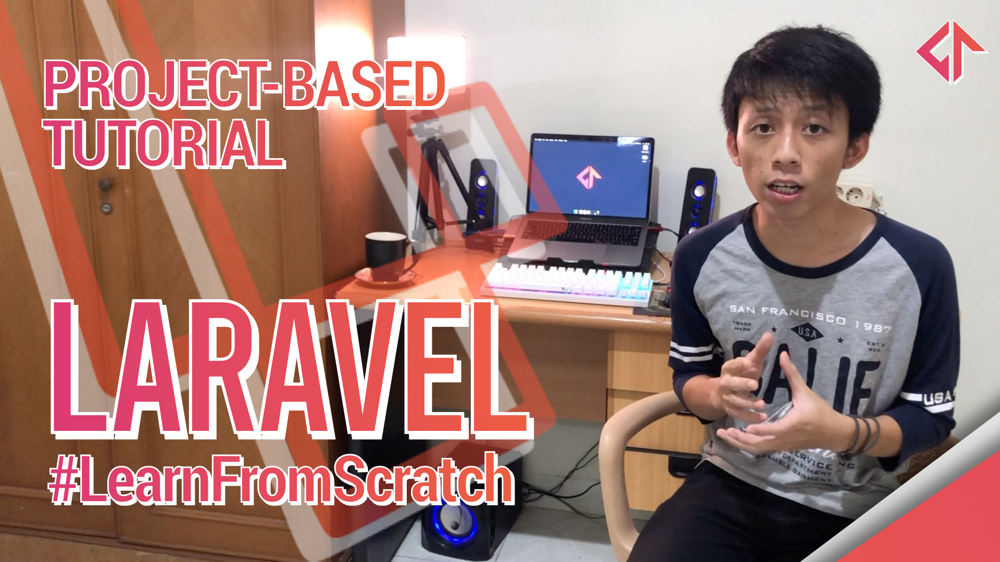

<h1>Laravel Blog Project Tutorial from Scratch</h1>

This tutorial is available on youtube : <a href="https://youtu.be/sP_xa7XN6SE">https://youtu.be/sP_xa7XN6SE</a>

In this tutorial we will build a public blog. Any user can register, login and create a blog post.

<h2>Materials</h2>

This tutorial will cover some of the fundamental concepts of Laravel. After finishing this tutorial, you will be able to build a production ready web app.

<ul>
  <li>Artisan Commands
    <ul>
      <li>Create Model, Migrations and Seeder</li>
      <li>Create controller</li>
      <li>Create components</li>
    </ul>
  </li>
  <li>Migrations
    <ul>
      <li>Create migrations</li>
      <li>Create seeder</li>
    </ul>
  </li>
  <li>Model
    <ul>
      <li>Eloquent</li>
      <li>Table relation</li>
    </ul>
  </li>
  <li>Authentication
    <ul>
      <li>Laravel Auth UI Scaffolding</li>
    </ul>
  </li>
  <li>Routing
    <ul>
      <li>Auth Middleware</li>
      <li>POST, PUT, DELETE</li>
      <li>Grouping and naming</li>
    </ul>
  </li>
  <li>Controllers
    <ul>
      <li>Show View</li>
      <li>Request</li>
      <li>Flash message</li>
      <li>Validation</li>
    </ul>
  </li>
  <li>Form
    <ul>
      <li>CSRF Token</li>
      <li>Input validations</li>
      <li>Show input errors</li>
      <li>Retrieve old input values</li>      
    </ul>
  </li>
  <li>File
    <ul>
      <li>Uploading</li>
      <li>Deleting</li>
    </ul>
  </li>
  <li>Blade Templating
    <ul>
      <li>Components / Anonymous Components</li>
      <li>Conditional</li>
      <li>Common blade directives</li>
      <li>Layout</li>
    </ul>
  </li>
  <li>Bonuses
    <ul>
      <li>Bootstrap</li>
      <li>Pagination</li>
      <li>Search Functionality</li>
    </ul>
  </li>
</ul>
<h2>Running this project</h2>
<h3>.env file</h3>

Make sure you have .env file that contains correct informations about your environment. If you don't, just create .env file based on `.env.example` file.

<h3>run migrations</h3>

Run the migrations by using this command. This command will create all the tables and run the seeder.

<pre>
php artisan migrate:fresh --seed
</pre>
<h3>javascript and css</h3>

Before we run the project, we should install javascript module by using this command :

<pre>npm install</pre>

And after that, run this command to build the development version of javascript and css :

<pre>npm run dev</pre>
<h3>run project</h3>

Finally, run the project by using this command.

<pre>
php artisan serve
</pre>
